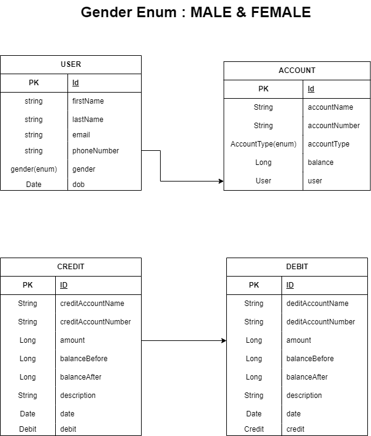

# Small-Money-Transfer-App

## Introduction

Welcome to the documentation for a small Money Transfer Service.
A Spring Boot application designed to facilitate fund transfers between user accounts. This document provides an overview of the application's purpose, features, and key specifications.

## Application Overview

The Money Transfer Service is a Java-based Spring Boot application.
It started out as an API only using the beginner knowledge I had in Spring framework.
A frontend will be added shortly using Thymeleaf.
The application is simple and plain. The user can create multiple users if successful an account will be generated,
and funded with an amount of money which transactions can be done with.

## Specifications

- **Technology Stack**: Java, Spring Boot.
- **Database**: Compatible relational databases (e.g., MySQL).
- **API Interface**: RESTful API for easy integration with other applications.
- **Error Handling**: Comprehensive error handling for various scenarios, including insufficient balance and account not found.
- **Documentation**: Detailed documentation to assist developers in using the service on Swagger.
- **Contribution**: Open to contributions from the community (see contributing guidelines).

## Model

## App directory
-  **config:** This contains the swagger documentation
- **controller:** The rest controller setup
- **dto:** It holds the response classes and the user creation dto
- **enums:** It holds the enums type
- **model:** The model entity class
- **repository:** Contains the JPA repository class
- **service:** The business logic

[//]: # (## **Access the Application**:)

[//]: # (The application will be accessible at `http://localhost:8081`.)

> [!NOTE]
> This document provides an overview. For detailed information on usage and implementation, please refer to the sections and documentation that follow.
